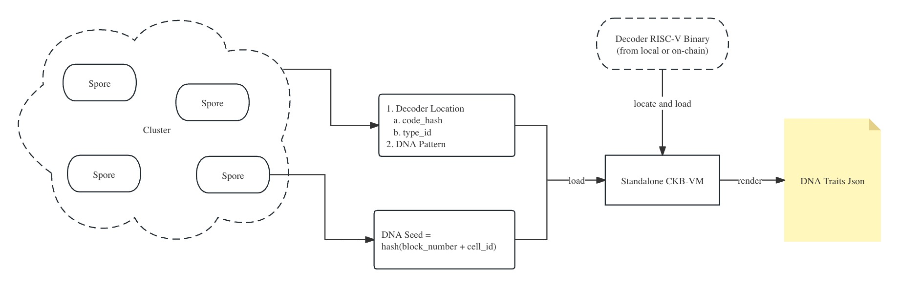

# spore-dob-0

DOB0 protocol aims to create a flexiable rendering process of the DNA bytes. It's the first implementation in DOB protocol family, so we name it with the number `ZERO`.

## Protocol detail
DOB0 protocol requires a parsing pattern that helps to define which part of DNA bytes indicates what trait name and which trait value to select from the traits pool. The pattern, mentioned above, is in format of molecule, and the `.mol` file can be found [here](https://github.com/sporeprotocol/spore-dob-721/blob/master/src/schema/dob_721.mol).

DOB0 protocol requires DOB artist to pre-define a collection DNA traits pool, as the pattern, and each single or batch bytes in DNA will be recongnized an offset pointer that to indicate a specific trait item in the pool. The combination of all selected trait items is the final rendered DNA, for instance:

```javascript
// DNA bytes in Spore 
{
    contentType: "dob/0",
    content: {
        block_number: 12559090,
        cell_id: 8902282834237953893,
        dna: "0xefc2866a311da5b6dfcdfc4e3c22d00d024a53217ebc33855eeab1068990ed9d"
    },
    content_id: "0x3b0e340b6c77d7b6e4f1fb2946d526ba65bfd196a27d9a7e5b6f06b82af5d07e"
}

// Pattern instance in Cluster
{
    name: "DOBs collection",
    description: {
        description: "Unicorn Collection",
        dobs: {
            decoder: {
                format: "RISC-V" or "Lua" or "JS",
                type: "code_hash" or "type_id",
                hash: "0x4f441345deb88edb39228e46163a8f11ac7736376af8fe5e791e194038a3ec7b",
            },
            pattern: "0xd48869363ff41a103b131a29f43...d7be6eeaf513c2c3ae056b9b8c2e1",
            dna_bytes: 32
        }
    }
}
```

`0xefc2866a311da5b6dfcdfc4e3c22d00d024a53217ebc33855eeab1068990ed9d` is the DNA bytes, which DOB0 decoder will parse one by one. `pattern: "0xd48869363ff41a103b131a29f43...d7be6eeaf513c2c3ae056b9b8c2e1"` is the pattern created by Cluster artist, which will be also parsed in DOB0 decoder in the meantime. In addition, the pattern is a hexed string of [TraitsBase](https://github.com/sporeprotocol/spore-dob-721/blob/master/src/schema/dob_721.mol#L43) bytes.

For real-world use case, this DOB0 decoder program is referenced by [decoder-template-rust](https://github.com/sporeprotocol/decoder-template-rust) and compiled into RISC-V binary. Then, we have two different methods to put it on-chain:
1. record the hash of binary on-chain
2. deploy the binary into an on-chain CKB cell with `type_id` enabled

`type: "code_hash"` means the below `hash` is a CKB personalizied blake2b hash of DOB0 decoder RISC-V binary. To be contrast, `type: "type_id"` means the below `hash` is a `type_id` args value that points to an on-chain cell which keeps the DOB0 decoder RISC-V binary in ins `data` field.

## Diagram

